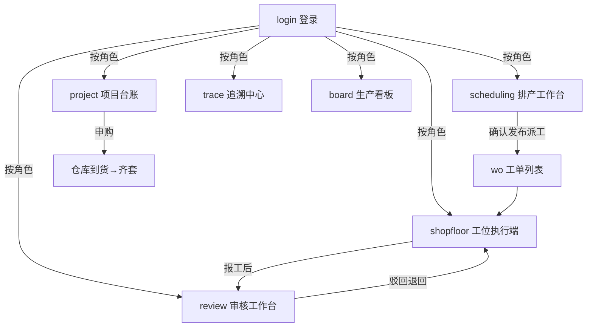

# MES 制造执行系统 · 低保真原型规格（项目实例）

> 本文件是 `prototype-spec-template/prototype-spec.md` 的 **MES 项目实例**，按模板章节组织。模板与全局规范独立维护，本文件只承载 MES 自身事实。
>
> 引用：视觉/组件规范 → `prototype-spec-template/global-design-system.md`（默认值即本项目在用值，无覆盖）；权限 → 第七章（演示初始数据，生产环境自定义配置）。
>
> 配套交付：`mes-prototype-figma/`（Figma 插件，按本规格生成可编辑原型）。

---

## 一、项目定位

- 名称：MES 制造执行系统
- 定位：汽车零部件模具制造企业的制造执行系统，覆盖「项目 → 排产 → 工位执行 → 审核 → 看板 → 追溯」全流程。
- 演示口径：模具制造（拉延模/翻边模/冲孔模），工艺链 设计 → CNC 加工 → 热处理 → EDM 精加工 → 钳工装配 → 试模。
- 版本：v0.2（本次迭代：新增第七章权限模型的演示账号说明）

## 二、页面清单（信息架构）

| ID | 名称 | 主要用途 | 层级 |
|---|---|---|---|
| login | 登录 | 身份验证，登录后按角色跳转首页 | 1 级 |
| shopfloor | 工位执行端 | 扫码开工、绑定批次、报工、安灯上报 | 1 级 |
| scheduling | 排产工作台 | 待排队列、交期倒排、模拟/正式排产 | 1 级 |
| review | 审核工作台 | 工序报工审核（通过/驳回） | 1 级 |
| board | 生产看板 | 进度、报工、齐套、安灯实时总览 | 1 级 |
| trace | 追溯中心 | 正向 SN / 反向批次追溯、用料追溯 | 1 级 |
| wo | 工单列表 | 工单查询、筛选、详情时间线 | 1 级 |
| project | 项目台账 | 项目进度、外购件申购 | 1 级 |

## 三、全局规范引用

- 视觉与组件：遵循 `prototype-spec-template/global-design-system.md`；本项目覆盖项：**无**（全部用默认值）。
- 全局交互约定：所有"提交/确认"按钮提交后置「待审核」；驳回必须填写原因；页面跳转 dissolve 200ms。
- 页面 ID 命名：小写英文语义化，与 HTML hash / Figma Frame 一致，不得改名。

## 四、逐页规格

### 4.1 登录页 login

- 用途：身份验证，登录后按角色跳转首页。
- 改版说明（feature-login 分支）：新增短信验证码登录（模拟）。
- 布局区块（自上而下）：
  1. 大标题「MES 制造执行系统」+ 副标题「演示原型 v0.1 · 汽车零部件模具制造」（居中）
  2. 登录卡片：用户名（placeholder「如 admin / planner」）、密码（掩码）、登录按钮
  3. 底部说明：演示账号清单 + 交互提示
- 关键字段：用户名、密码。
- 交互规则：点击登录 → 校验 → 成功按角色跳转（见第五章）；失败提示「用户名或密码错误」。
- 演示数据：演示账号见第七章（admin / planner / director / proj01 / design01 / prog01 / wh01 / op01-op05 / quality）。

### 4.2 工位执行端 shopfloor

- 用途：操作工完成扫码开工、绑定批次、报工、安灯上报。
- 布局区块（自上而下）：
  1. 顶栏：工位与操作工（「工位：CNC 1# ｜ 操作工：张三」）+ 退出
  2. 当前任务卡：任务名（MOLD-1001 前门内板拉延模）、工序进度（2/6 CNC 粗加工）、加工组（大件组 3 件）、编程号（P-1001-2）、铁板规格（12mm×2000×1000）
  3. 3 步闭环：① 扫码开工 → ② 绑定铁板批次 → ③ 报工 + 提交确认（数量/工时）→「④ 提交确认 → 待审核」
  4. 安灯上报区：缺料/设备/质量/其他 + 备注
  5. 底部权限说明
- 关键字段：SN、批次号、报工数量、工时、安灯类型、备注。
- 交互规则：扫码枪=键盘回车；提交后状态置「待审核」；数据范围=自己，仅本工位任务。
- 演示数据：任务 MOLD-1001 前门内板拉延模；工序 2/6 CNC 粗加工；加工组 大件组（3 件）；编程号 P-1001-2；铁板规格 12mm×2000×1000；工位 CNC 1#、操作工 张三；示例报工 数量 3、工时 2.9。

### 4.3 排产工作台 scheduling

- 用途：计划科对待排工单做交期倒排与发布派工。
- 布局区块（自上而下）：
  1. 顶栏：模拟模式/正式模式切换
  2. 待排工单队列表：工单号/产品/承诺交期/风险/操作（倒排建议）
  3. 建议排期表：工序/最晚开始/最晚结束/工位/状态（正常/冲突/待齐套）
  4. 调整操作区：改开始时间、换工位、即时重算
  5. 发布区：确认发布 → 派工；与客户协商/确认延期
- 关键字段：工单号、产品、交期、工序时间、工位、风险状态。
- 交互规则：每次调整后即时重算冲突与交期，只提示不强制；模拟模式不占产能。
- 演示数据：待排工单 WO-001 前门内板拉延模（承诺 3/31，逾期 2 天红标）、WO-002 A柱加强板翻边模（承诺 4/05，正常）。建议排期（WO-001）：设计 3/17-18 D1 正常；CNC 加工组 3/19-21 CNC 1# 与 WO-003 冲突（橙标）；热处理 3/22-23 H1 正常；EDM 精加工 3/24-26 EDM 3# 正常；钳工装配 3/27-28 装配 2# 待齐套缺 2 项（灰标）；试模 3/29-31 试模台 1# 正常。

### 4.4 审核工作台 review

- 用途：车间主任/科长审核工序报工。
- 布局区块（自上而下）：
  1. 顶栏：待审核计数
  2. 待审核列表：工单/工序环节/提交人/提交时间/通过/驳回
  3. 驳回弹窗：原因（必填）
  4. 已审核记录表：工单/环节/审核人/结果/时间/原因
- 关键字段：审核结果、驳回原因。
- 交互规则：驳回必填原因、退回提交人、不限次数；主任审全部工序、科长审本科室。
- 演示数据：待审核 3 项——WO-001 CNC 加工组 张三 10:32；WO-001 钳工装配 李四 09:15；WO-002 设计审核 王工 08:40。已审核：WO-002 设计 设计科长 通过 3/18；WO-001 编程 编程科长 驳回 3/19（原因「程序路径需修正」）。

### 4.5 生产看板 board

- 用途：全员实时总览。
- 布局区块（自上而下）：
  1. 顶栏：自动刷新 10s、全屏
  2. 4 指标卡：在产工单 / 今日报工 / 齐套检查 / 安灯（安灯数字红色强调）
  3. 产线进度表：产线/工单/当前工序/进度条/达成率/风险
  4. 安灯实时表：工位/类型（红缺料·橙质量）/持续/状态/处理
- 关键字段：各指标数字、进度百分比、安灯类型与时长。
- 交互规则：10s 自动刷新；操作工限本组、质量科只读；逾期风险红色高亮。
- 演示数据：指标——在产工单 6（完成 2、逾期风险 1）；今日报工 128（待审核 5）；齐套检查 2/6（缺料工单 1）；安灯 2（缺料 1、质量 1）。产线进度：CNC/WO-001/3-6 热处理/75%；CNC/WO-002/1-6 设计/20% 临期；装配/WO-001/齐套检查/待齐套。安灯实时：CNC 2# 缺料 14 min；装配 1# 质量 5 min。

### 4.6 追溯中心 trace

- 用途：正向 SN / 反向批次追溯。
- 布局区块（自上而下）：
  1. 顶栏：正向：SN / 反向：批次 切换
  2. 正向追溯表：环节/时间/执行人/工位/结果/审核
  3. 用料追溯表：类别/物料/批次来源/数量 + 导出 CSV
- 关键字段：SN、批次号、环节记录、物料批次。
- 交互规则：反向输入批次号 → 列出受影响模具清单；导出 CSV。
- 演示数据：SN MOLD-2025-0001，5 环节——设计 3/17 王工 D1 完成 科长通过；CNC 加工组 3/19-21 张三 CNC 1# 完成 主任通过；热处理 3/22-23 外协/炉 H1 完成 主任通过；钳工装配 3/27-28 李四 装配 2# 完成 主任通过；试模 3/29-31 赵工 试模台 1# 样板 ×1 主任通过。用料：模架板 12mm 批次 B-001（供应商/炉号）1 张；导柱 φ40 库存 4 件；导套 φ60 库存 4 件。

### 4.7 工单列表 wo

- 用途：计划科查询与管理工单。
- 布局区块（自上而下）：
  1. 顶栏：新建工单
  2. 工单列表：工单号/项目/产品/交期/当前环节/状态/风险
  3. 筛选区：状态/产品/交期/产线；交期风险列表高亮
  4. 工单详情（工序时间线）：序号/工序/计划/实际/状态/审核
- 关键字段：工单状态、交期、工序时间线。
- 交互规则：筛选联动列表；风险列表逾期/临期高亮。
- 演示数据：WO-001 P-2025-01 前门内板拉延模 3/31 钳工装配（待齐套）生产中 正常；WO-002 P-2025-02 A柱加强板翻边模 4/05 设计（审核中）生产中 临期；WO-003 P-2025-03 翼子板冲孔模 4/10 模拟排期 已排产 正常。详情时间线（WO-001）：1 设计 3/17-18 完成 科长✅；2 CNC 加工组 3/19-21 完成 主任✅；3 热处理 3/22-23 完成 主任✅；4 EDM 精加工 3/24-26 待执行。

### 4.8 项目台账 project

- 用途：项目科管理项目与外购件申购。
- 布局区块（自上而下）：
  1. 顶栏：新建项目
  2. 项目表：项目编号/名称/客户/图纸引用/状态/进度
  3. 外购件申购表：申购单/外购件/数量/需求日期/状态（已到货/申请中）
- 关键字段：项目状态、进度、申购状态。
- 交互规则：申购由项目科发起、仓库科到货；流程 排期模拟 → 线上演示 → 确认发布。
- 演示数据：项目 P-2025-01 某车型门板模具开发 车架事业部 DW-2201 开发中 3/6 工序；P-2025-02 某车型侧围模具开发 车架事业部 DW-2203 模拟排期 1/6。申购：PR-001 导柱 φ40 ×4 需求 3/25 已到货；PR-002 标准件组套 ×1 需求 3/28 申请中。

## 五、跳转流程

- 角色首页映射（权限为演示初始数据，见第七章）：

| 角色 | 首页 |
|---|---|
| 操作工 | shopfloor |
| 计划科 | scheduling |
| 车间主任 | review |
| 项目科 | project |
| 质量科 | trace |
| 管理员 | board |

- 主流程（文字版）：

```
login ──登录──▶ 按角色首页
首页 ──顶部导航──▶ 任意页面（8 页互通）

排产流程：scheduling 倒排建议 → 即时重算 → 确认发布 → 派工（生成工单）
执行流程：shopfloor 扫码开工 → 绑定批次 → 报工 → 状态=待审核 → review 通过/驳回
          （驳回 → 退回提交人附原因 → 重新报工）
追溯流程：trace 输入 SN → 展示全工序记录 + 用料批次
          （反向：输入批次号 → 受影响模具清单）
采购流程：project 发起申购 → 申请中 → 仓库到货 → 已到货（齐套）
```

- 分支约定：操作列按钮（通过/驳回/倒排建议/处理/导出）均须有去向；不得留死按钮。

## 六、状态矩阵

### 6.1 登录 login

| 状态 | 触发条件 | 表现 | 提示文案 |
|---|---|---|---|
| 错误态 | 密码错误 | 输入框红框 + 提示 | 「用户名或密码错误」 |
| 错误态 | 账号不存在 | 同上 | 「账号不存在」 |
| 错误态 | 账号被禁用 | 同上 | 「该账号已停用，请联系管理员」 |
| 加载态 | 提交校验中 | 按钮置灰转圈 | — |

### 6.2 工位执行端 shopfloor

| 状态 | 触发条件 | 表现 | 提示文案 |
|---|---|---|---|
| 错误态 | SN 无效或非本工位 | 步骤 1 红框 | 「SN 无效或不属于本工位」 |
| 错误态 | 铁板批次无效 | 步骤 2 红框 | 「批次不存在，请重新扫码」 |
| 错误态 | 重复报工 | 步骤 3 拦截 | 「该工序已报工，请勿重复提交」 |
| 边界 | 报工数量超计划 | 校验拦截 | 「数量超出本工序计划」 |
| 权限不足 | 非本工位任务 | 页面置灰提示 | 「当前账号仅可操作本工位任务」 |
| 加载态 | 扫码后读取任务 | 骨架屏/转圈 | — |

### 6.3 排产工作台 scheduling

| 状态 | 触发条件 | 表现 | 提示文案 |
|---|---|---|---|
| 空态 | 无待排工单 | 队列表空态 | 「暂无待排工单」 |
| 错误态 | 交期无法满足 | 红线 + 建议延期 | 「当前产能无法满足交期，建议与客户协商延期」 |
| 冲突态 | 资源冲突无法消解 | 冲突行橙标 | 「与 WO-XXX 冲突，需人工调整」 |
| 提示态 | 模拟模式 | 顶部常驻标识 | 「模拟模式不占产能」 |

### 6.4 审核工作台 review

| 状态 | 触发条件 | 表现 | 提示文案 |
|---|---|---|---|
| 空态 | 无待审核项 | 列表空态 | 「暂无待审核事项」 |
| 校验 | 驳回未填原因 | 弹窗内拦截 | 「请填写驳回原因」 |
| 重复 | 重复审核同一提交 | 拦截 | 「该提交已处理」 |
| 权限不足 | 非本科室/无权工序 | 列表隐藏 | — |

### 6.5 生产看板 board

| 状态 | 触发条件 | 表现 | 提示文案 |
|---|---|---|---|
| 空态 | 无在产工单 | 指标卡显示 0 | 「当前无在产工单」 |
| 加载态 | 10s 刷新中 | 顶部转圈/时间戳 | — |
| 错误态 | 刷新失败 | 数据区灰显 + 重试 | 「数据刷新失败，点击重试」 |
| 告警 | 安灯超时未处理（>30min）【待确认】 | 红色闪烁 | 「安灯超时，请立即处理」 |

### 6.6 追溯中心 trace

| 状态 | 触发条件 | 表现 | 提示文案 |
|---|---|---|---|
| 空态 | SN 无记录 | 表格空态 | 「未查询到该 SN 的追溯记录」 |
| 空态 | 批次无关联模具 | 反向结果空态 | 「该批次未关联任何模具」 |
| 错误态 | 导出失败 | toast | 「导出失败，请重试」 |

### 6.7 工单列表 wo

| 状态 | 触发条件 | 表现 | 提示文案 |
|---|---|---|---|
| 空态 | 筛选无结果 | 列表空态 | 「无符合条件的工单」 |
| 错误态 | 工单不存在/已删除 | 详情页空态 | 「工单不存在或已被删除」 |

### 6.8 项目台账 project

| 状态 | 触发条件 | 表现 | 提示文案 |
|---|---|---|---|
| 空态 | 无项目 | 项目表空态 | 「暂无项目，点击新建」 |
| 错误态 | 申购被驳回 | 申购行红标 + 原因 | 「申购被驳回：{原因}」 |
| 提示态 | 到货延期【待确认】 | 橙标 | 「已延期，预计 {日期} 到货」 |

## 七、权限模型（配置化，非硬编码）

- 权限机制：角色 → 数据范围 → 操作权限 三级；数据范围取值 全局/科室/本工位/只读。
- **演示初始数据**（仅演示用；生产环境由系统管理端自定义配置，本表不约束实现）：

| 账号 | 角色 | 数据范围 | 关键权限 |
|---|---|---|---|
| admin | 管理员 | 全局 | 全部功能 |
| planner | 计划科 | 全局 | 排产工作台、工单管理 |
| director | 车间主任 | 全局 | 审核工作台（全部工序） |
| proj01 | 项目科 | 本项目 | 项目台账、外购件申购 |
| design01 | 设计科 | 本科室 | 设计工序、本科室审核 |
| prog01 | 编程科 | 本科室 | 编程工序、本科室审核 |
| wh01 | 仓库科 | 本仓库 | 物料到货、齐套检查 |
| op01-op05 | 操作工 | 本工位 | 扫码开工、报工、安灯上报 |
| quality | 质量科 | 只读 | 看板、追溯查询 |

- 页面访问控制：第二章页面清单中的"访问角色"按本快照实现首版即可；页面-角色映射为配置快照，运行时可变。

## 八、生成与评审检查清单

**生成前必答**：
1. 页面清单是否与第二章完全一致（8 页，ID 不变）？
2. 每页是否按第四章四要素逐项覆盖，无遗漏区块？
3. 视觉是否遵循 `global-design-system.md`（本项目无覆盖项）？
4. 权限是否按第七章演示初始数据实现，且未把权限写死进业务逻辑？
5. 状态矩阵是否至少覆盖每页 空/载/错/权 四类？

**评审三列法**：

| 已满足 | 未满足 | 存疑 |
|---|---|---|
| 逐条列出 | 逐条列出并给修改方案 | 需人确认的点 |

**禁止事项**：不得新增未列入第二章的页面；不得改页面 ID；不得把演示账号写成真实系统账号；未标【待确认】的文案不得自行发挥。

## 九、prompt 组装模板

```
请基于《MES 制造执行系统 原型规格》生成/评审 HTML 低保真原型：
1. 按第二章实现 8 个页面，按第四章实现每页布局，按第五章实现跳转交互，按第六章补齐状态；
2. 视觉遵循 prototype-spec-template/global-design-system.md；
3. 权限按第七章演示初始数据实现（9 角色）；
4. 完成后按第八章"评审三列法"输出自检。
```

---

### 附录：Mermaid 主流程图


